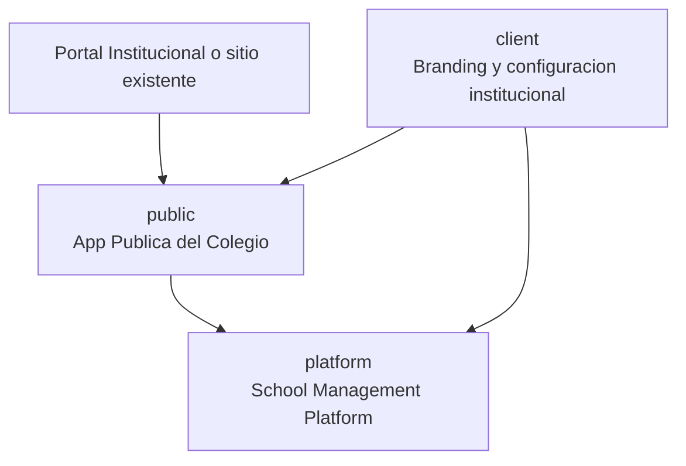
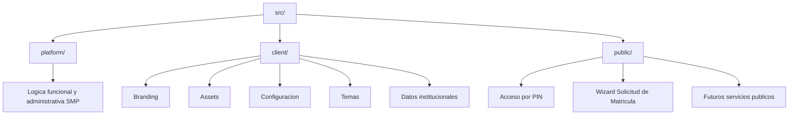

# 03 - ARQUITECTURA SMP

Estado: Permanente
Version: 1.2
Ambito: School Management Platform (SMP)

## 1. Proposito

Este documento define las reglas permanentes de arquitectura del SMP.

- Es la fuente oficial para decisiones de estructura tecnica.
- Sus reglas aplican a todas las phases y todos los sprints.
- Ninguna regla permanente debe vivir en SPRINT-ACTUAL.md.

## 2. Principios permanentes

- Reusable First.
- Single Responsibility.
- Desarrollo Just-in-Time.
- Componentes reutilizables.
- Helpers puros.
- Hooks reutilizables.
- Services desacoplados.
- Types centralizados.
- Constantes compartidas.
- Eliminacion inmediata de codigo obsoleto.
- No duplicacion de logica.
- Una unica arquitectura vigente.
- Toda decision permanente debe quedar documentada.
- Cada Phase debe finalizar con limpieza arquitectonica.
- Todo componente debe tener una unica responsabilidad.

## 2.1 Politica permanente: Desarrollo Just-in-Time

- No crear archivos, carpetas o documentacion sin uso inmediato en el sprint vigente.
- Todo archivo nuevo debe ser usado dentro del mismo sprint en que se crea.
- Crear types, tests, helpers o documentacion solo cuando exista una necesidad real.
- Si un componente o modulo requiere un conjunto minimo de archivos, crear solo ese minimo.
- Si una refactorizacion deja archivos sin uso, migrar lo necesario, eliminarlos y validar build.

Objetivo operativo: mantener un repositorio limpio, pequeno y sin infraestructura muerta.

## 3. Protocolo obligatorio de implementacion

Antes de construir cualquier pantalla o modulo se define, en este orden:

1. Componentes reutilizables necesarios.
2. Hooks reutilizables.
3. Helpers (utils) necesarios.
4. Services necesarios.
5. Types necesarios.
6. Constantes necesarias.

Solo despues de completar esta base se ensambla la pantalla.

## 4. Ciclo obligatorio de entrega

Construir -> Consolidar -> Limpiar -> Visualizar -> Documentar -> Commit

## 5. Reglas de limpieza y consolidacion

- No dejar estructuras duplicadas.
- Remover de inmediato cualquier estructura obsoleta desplazada por la arquitectura vigente.
- Corregir imports afectados por migraciones o limpieza.
- Validar compilacion y ejecucion visual antes de cierre de entrega.

## 5.1 Politica permanente de consolidacion de calidad

Toda implementacion debe finalizar con una fase obligatoria de consolidacion.

Antes de dar por terminado cualquier trabajo se debe verificar:

- Arquitectura consistente.
- Codigo limpio.
- Buenas practicas.
- Sin duplicacion.
- Sin archivos obsoletos.
- Imports correctos.
- Compilacion exitosa.
- Documentacion sincronizada.

Objetivo operativo: impedir cierres parciales, deriva arquitectonica y deuda tecnica silenciosa entre sprints.

## 6. Relacion documental

Flujo oficial de contexto:

START-HERE
-> PLAN-MAESTRO
-> ARQUITECTURA
-> PLANIFICACION
-> SPRINT-ACTUAL

## 7. Gobernanza

- Este documento se actualiza solo por decisiones permanentes de arquitectura.
- Todo cambio aqui debe reflejarse en PLANIFICACION y START-HERE cuando afecte jerarquia o flujo.

## 8. Decisiones permanentes (2026-07-14)

- Principio estructural: Primero los catalogos, despues los procesos.
- Eje funcional del sistema: PeriodoLectivo.
- Separacion obligatoria de datos: catalogos maestros y datos operativos no deben mezclarse.
- Entidad raiz para crecimiento futuro: Institucion.
- Principio permanente de producto: cada funcionalidad debe ahorrar tiempo, reducir errores o facilitar la toma de decisiones.

## 9. Decisiones permanentes aprobadas (2026-07-15)

### 9.1 Integridad referencial transversal obligatoria

- La plataforma debe validar coherencia referencial transversal entre Institucion, PeriodoLectivo, Nivel, Grado, Grupo y Asignatura.
- Ningun caso de uso puede confirmar altas o actualizaciones que generen relaciones huerfanas o cruces institucionales invalidos.
- La regla canonica vive en capa de aplicacion/dominio como politica reusable y transversal.
- Las restricciones de persistencia se aplican como red de seguridad y no reemplazan la validacion funcional.

### 9.2 Concurrencia estandar con Optimistic Locking

- Todos los agregados institucionales y academicos deben operar con contrato homogeneo de versionado.
- La politica oficial de concurrencia del SMP es Optimistic Locking transversal.
- Cada comando de escritura debe incluir version esperada y fallar con conflicto de concurrencia si la version no coincide.
- El contrato minimo por agregado incluye: id, institucionId, version, updatedAt, updatedBy.

### 9.3 Ambito del contrato homogeneo

- Institucion
- PeriodoLectivo
- Nivel
- Grado
- Grupo
- Asignatura

## 10. Decision permanente aprobada (2026-07-17)

### 10.1 Modelo oficial de separacion de responsabilidades

La arquitectura oficial del proyecto se organiza en tres capas de responsabilidad:

- `src/platform/`: nucleo del producto SMP.
- `src/client/`: personalizacion por colegio.
- `src/public/`: aplicacion publica del colegio.

Objetivo:

- Permitir que SMP opere como producto independiente.
- Permitir que cada colegio personalice identidad y configuracion sin invadir el nucleo.
- Permitir que la App Publica pueda exponerse desde cualquier portal externo sin depender del dashboard administrativo.

### 10.2 Estructura oficial

### 10.3 Reglas oficiales de dependencia

- `platform` no depende de `public`.
- `public` puede consumir componentes, contratos y servicios expuestos por `platform`.
- `client` no contiene logica funcional del SMP.
- `client` solo provee identidad institucional, configuracion y personalizacion visual.
- `public` no debe depender del shell administrativo ni de navegacion de `/app`.
- `public` no debe incorporar permisos, sidebar ni layouts del dashboard administrativo.
- `platform` conserva la logica funcional y administrativa del producto.
- Todo flujo publico que necesite un modulo funcional debe consumirlo sin duplicarlo.

### 10.4 Aplicacion de la decision en Sprint 1.9

- Se creo `src/platform/student-enrollment/ui` como fachada de consumo para el wizard existente.
- Se creo `src/client/institutional/branding.ts` para branding institucional inicial.
- Se creo `src/public/` como base de la futura App Publica del Colegio.
- Se migro la entrada publica actual hacia una pantalla profesional de acceso y una ruta publica dedicada para el wizard.
- El dashboard administrativo en `/app` permanece desacoplado y sin alteraciones funcionales.

### 10.5 Consolidacion A-028 - branding y tema institucional

- La identidad institucional debe consumirse desde `src/client/` y no desde modulos funcionales ni paginas duplicadas.
- El encabezado institucional reusable debe vivir en `src/client/` para poder ser compartido entre App Publica y dashboard sin duplicacion.
- La tipografia institucional oficial queda definida como `Montserrat SemiBold` para branding y `Plus Jakarta Sans` para interfaz.
- Las personalizaciones visuales por colegio deben aplicarse como override de runtime desde `client`, preservando el nucleo reusable de `platform`.

### 10.6 Fase 2 - tipografia oficial de la App Publica

- La App Publica debe usar `Quicksand` como fuente oficial de interfaz.
- La aplicacion de esta fuente debe hacerse desde el sistema central de tipografia y no mediante overrides por componente.
- El branding del logo institucional mantiene su fuente y no debe alterarse por esta decision.

### 10.7 Capa publica institucional dedicada

- Se formaliza `src/public/portal/` como capa oficial para la experiencia publica institucional del colegio.
- Esta capa encapsula layout, navegacion publica, secciones institucionales y paginas de entrada.
- El flujo publico de Matricula se organiza por rutas desacopladas:
  - `/` portal institucional.
  - `/acceso-matricula` control de acceso por PIN.
  - `/solicitud-matricula` wizard publico.

### 10.8 Separacion obligatoria: SMP interno vs portal del colegio

- La Plataforma SMP interna (administracion) y el Portal Publico del colegio son dos experiencias distintas.
- El portal publico no debe incorporar sidebar administrativa, permisos RBAC ni componentes de `AuthLayout`.
- El dashboard administrativo no debe depender de la capa `src/public/portal/`.

### 10.9 Branding institucional configurable y preparacion multiinstitucion

- El portal publico consume identidad institucional desde `src/client/institutional/`.
- `websiteUrl` y demas datos de identidad se consideran configurables por institucion cliente.
- La arquitectura queda preparada para multiples instituciones sin clonar logica del nucleo SMP.
- Toda variacion institucional debe resolverse en `client`, preservando el nucleo reusable en `platform`.
