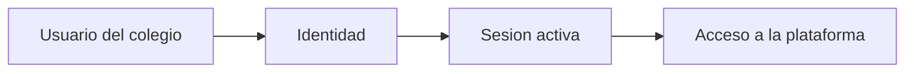
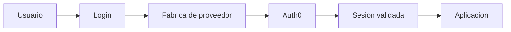
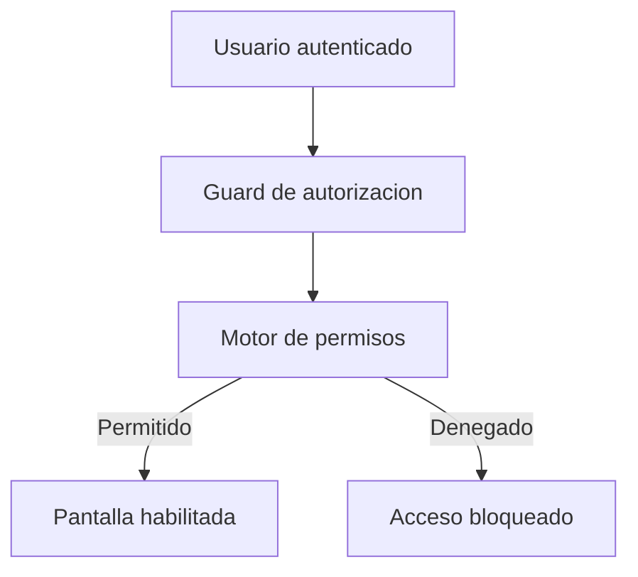
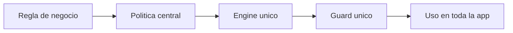
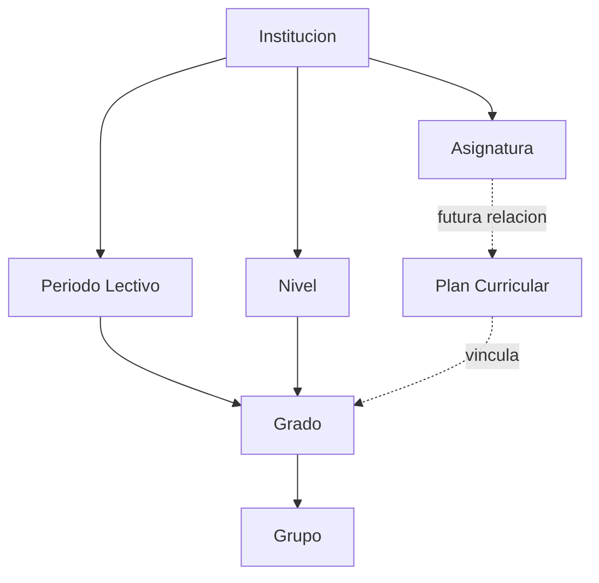
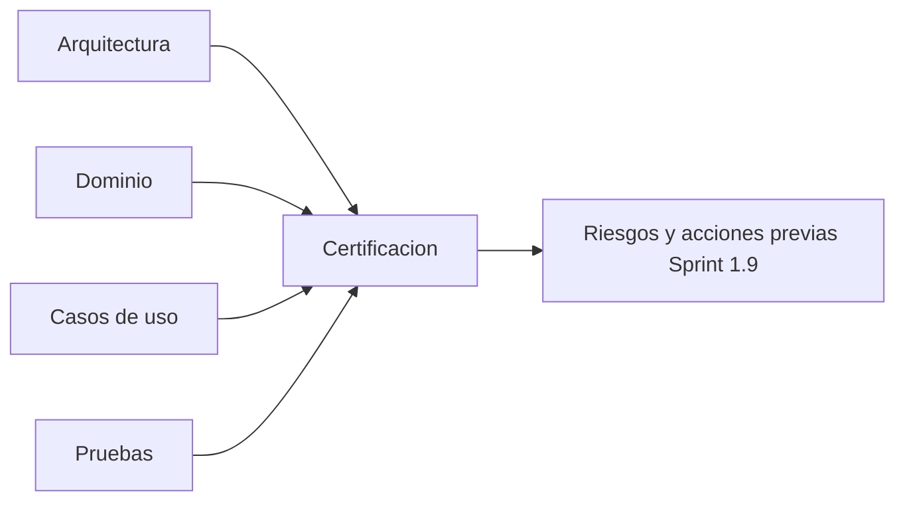
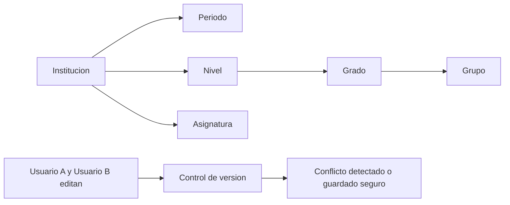

# LIBRO DEL PROYECTO EL CERVANTISTA

> Documento permanente para Direccion del Proyecto, clientes y nuevos integrantes.
> Cuenta la evolucion completa del producto como una narracion por capitulos.

---

## Como mantener este documento

- Este documento es el Libro Oficial del Proyecto.
- Cada sprint es un capitulo nuevo.
- Las secciones anteriores no se modifican; solo se agregan nuevos capitulos.
- No hacer resumenes ejecutivos dentro del libro.
- No describir codigo.
- Escribir en lenguaje coloquial, claro y profesional.
- Explicar siempre con enfoque de operacion escolar real.

## Reglas permanentes del Libro Oficial (vigente desde 2026-07-15)

- Nunca resumir la funcionalidad de la plataforma.
- Explicar cada modulo en lenguaje sencillo, orientado a personas sin conocimientos tecnicos.
- Explicar para cada modulo: que hace, por que existe, como lo usa un colegio y que beneficio aporta.
- Incluir beneficio por perfil: administrativos, docentes, estudiantes y directivos.
- Explicar relacion funcional con otros modulos y dar ejemplos practicos de uso.
- Este documento debe servir como manual funcional, material de capacitacion y apoyo para presentaciones comerciales.

## Formato obligatorio de cada capitulo

Cada nuevo sprint debe seguir este formato:

```
# Sprint X.X

## ¿Que problema teniamos antes de este sprint?
Situacion real en un colegio, explicada de forma simple.
## ¿Que decision de arquitectura tomamos y por que?
Explicacion en palabras sencillas de la decision y su motivo.
## ¿Que beneficio obtiene un colegio?
Impacto concreto para directivos, docentes, estudiantes o personal administrativo.

## ¿Que impacto deja para el futuro del sistema?

Como esta decision facilita los siguientes modulos y evita retrabajo.

## Ejemplo real de uso en un colegio

Caso cotidiano, breve y claro.

## Diagrama simple (opcional)

Puede incluirse un diagrama ASCII o Markdown cuando ayude a explicar.
```

Reglas de redaccion permanente:

- Escribir como si la persona lectora no supiera programar.
- Evitar tecnicismos innecesarios o explicarlos con ejemplos simples.
- Mantener tono profesional de documento para cliente y capacitacion.
- Priorizar claridad, contexto y utilidad practica.

## Filosofia del Libro del Proyecto

Este documento debe poder ser leido por:

- El Director del Proyecto.
- Un futuro cliente.
- Un inversionista.
- Un nuevo desarrollador.
- Un auditor de software.

Por lo tanto, cada capitulo debera responder estas preguntas:

1. ¿Que problema tenia el colegio antes de este sprint?
2. ¿Como se trabajaba antes?
3. ¿Que decidimos construir?
4. ¿Por que elegimos esa solucion y no otra?
5. ¿Que beneficios obtiene el usuario final?
6. ¿Que beneficios obtiene el colegio?
7. ¿Que beneficios obtiene el proyecto a futuro?
8. ¿Como se conecta este sprint con los siguientes?

Ademas:

- Cuando una decision de arquitectura sea importante, explicar por que se descartaron otras alternativas.
- Si una decision evita problemas futuros, explicarlo.
- Mantener un tono cercano, profesional y facil de entender.
- Escribir pensando que este documento podra imprimirse y entregarse como parte de la documentacion oficial del producto.

---

## Vision general

EL CERVANTISTA es una plataforma educativa en construccion por etapas.

Cada sprint agrega una capacidad concreta para acercar el producto a una operacion escolar completa, segura y escalable.

---

## Sprint 1.5 - Base de identidad

## ¿Que problema existia?

Antes de este sprint, cualquier sistema escolar corre un riesgo basico: no saber con certeza quien esta entrando. En la practica, eso se traduce en cuentas compartidas, contrasenas anotadas en papel y decisiones tomadas sin trazabilidad.

## ¿Como trabajaria un colegio sin esta solucion?

Sin una base de identidad, el rector no puede confiar plenamente en los reportes porque no hay evidencia clara de quien hizo cada accion. Coordinacion academica pierde tiempo validando manualmente usuarios. El docente puede quedar bloqueado o, peor, entrar con una cuenta equivocada. El estudiante y su familia no tienen confianza en la privacidad de su informacion.

## ¿Que decidimos construir?

Decidimos construir la base de identidad institucional: una estructura para reconocer a cada persona y asociarla con su perfil dentro del sistema.

Componentes creados y su funcion:

- Capa de identidad de usuario: representa a la persona que ingresa (por ejemplo: rector, coordinador, docente, estudiante).
- Servicio de sesion: conserva el estado de ingreso para que el usuario no tenga que autenticarse en cada clic.
- Contrato de proveedor de identidad: define reglas para conectarse con proveedores externos sin acoplar la aplicacion a uno solo.

Como se relacionan:

- La capa de identidad define quien es la persona.
- El servicio de sesion mantiene activa esa identidad durante el uso.
- El contrato de proveedor permite cambiar la tecnologia de autenticacion sin reescribir todo el sistema.

## ¿Por que esta arquitectura era la mejor?

Porque separa lo estable (reglas del negocio escolar) de lo cambiante (proveedor de login). Esto protege la inversion del colegio.

Concepto tecnico explicado: Clean Architecture.
Explicacion sencilla: es como construir un colegio donde primero diseñas los salones y procesos pedagogicos, y despues decides la marca del proyector o de las cerraduras. Si cambias la marca, el colegio sigue funcionando igual.

## ¿Que alternativas descartamos y por que?

- Login simple incrustado directamente en pantallas: se descarto porque obliga a tocar muchas vistas cuando cambia una regla de identidad.
- Manejar usuarios solo en memoria local: se descarto porque no es confiable para operacion real institucional.

## Beneficios concretos por rol

- Rector: obtiene trazabilidad inicial de acceso y mayor control institucional.
- Coordinador: reduce validaciones manuales de "quien es quien".
- Docente: entra con identidad clara y contexto correcto.
- Estudiante: gana privacidad y menor riesgo de confusiones de cuenta.
- Institucion: establece el primer cimiento de seguridad y gobierno digital.

## Beneficio para los proximos modulos

Todo lo que venga despues (permisos, estructura academica, reportes) depende de saber con certeza la identidad de la persona usuaria.

## Diagrama simple



---

## Sprint 1.6 - Inicio de sesion seguro

## ¿Que problema existia?

Tener identidad sin un mecanismo de autenticacion robusto es insuficiente. El sistema sabia "que tipo de persona" debia existir, pero faltaba validar de forma segura que realmente era esa persona.

## ¿Como trabajaria un colegio sin esta solucion?

Sin autenticacion fuerte, la operacion depende de practicas informales: contrasenas debiles, restablecimientos manuales, riesgo de suplantacion y sobrecarga administrativa.

## ¿Que decidimos construir?

Decidimos integrar un proveedor profesional de autenticacion (Auth0) sin acoplar el corazon del producto a una sola tecnologia.

Componentes creados y su funcion:

- Proveedor Auth0: valida credenciales con estandares modernos.
- Fabrica de proveedor de autenticacion: selecciona el proveedor activo segun configuracion.
- Servicio de autenticacion desacoplado: consume el contrato comun y expone operaciones de login/sesion al resto del sistema.

Como se relacionan:

- La fabrica decide que proveedor usar.
- El servicio habla con el proveedor a traves de un contrato comun.
- El resto del producto no depende de detalles internos de Auth0.

## ¿Por que esta arquitectura era la mejor?

Porque permite seguridad de nivel empresarial hoy, y libertad de cambiar proveedor manana sin reescribir los modulos funcionales.

Concepto tecnico explicado: Repository/Contrato de infraestructura.
Explicacion sencilla: es como pedir suministros escolares por un formato unico de solicitud. Hoy puede abastecer una papeleria, manana otra, pero el colegio no cambia su proceso interno.

## ¿Que alternativas descartamos y por que?

- Construir autenticacion casera desde cero: se descarto por costo, tiempo y riesgo de seguridad.
- Acoplar todas las pantallas directamente al SDK externo: se descarto por fragilidad ante cambios del proveedor.

## Beneficios concretos por rol

- Rector: reduce riesgo reputacional y legal por accesos inseguros.
- Coordinador: menos tickets de acceso y menos bloqueos manuales.
- Docente: ingreso mas estable y predecible.
- Estudiante: acceso mas seguro y confiable.
- Institucion: postura de seguridad madura desde etapa temprana.

## Beneficio para los proximos modulos

Los modulos academicos, administrativos y de reportes heredan una puerta de entrada confiable y auditable.

## Diagrama simple



---

## Sprint 1.7 - Control de permisos

## ¿Que problema existia?

Aunque ya se sabia quien entraba, todavia faltaba controlar con precision que podia hacer cada perfil dentro del sistema.

## ¿Como trabajaria un colegio sin esta solucion?

Sin control de permisos, un rol podria ver o editar informacion que no le corresponde. Esto genera riesgo academico, administrativo y de privacidad.

## ¿Que decidimos construir?

Decidimos construir una capa de autorizacion central para evaluar permisos por politica de acceso.

Componentes creados y su funcion:

- Motor de autorizacion: aplica reglas para permitir o negar acciones.
- Politicas de acceso por ruta: declaran que permiso exige cada seccion.
- Guard de autorizacion: bloquea entrada cuando el usuario no cumple la politica.

Como se relacionan:

- Las politicas describen la regla.
- El guard consulta el motor.
- El motor decide y devuelve autorizacion.

## ¿Por que esta arquitectura era la mejor?

Porque evita reglas repetidas en cada pantalla y mantiene coherencia institucional en todas las areas.

Concepto tecnico explicado: DDD (Domain-Driven Design).
Explicacion sencilla: es organizar el software usando el idioma real del colegio. En lugar de hablar en terminos tecnicos abstractos, el sistema habla de roles, permisos, periodos, grupos y asignaturas, igual que el equipo escolar.

## ¿Que alternativas descartamos y por que?

- Permisos evaluados manualmente por cada pantalla: se descarto por alto riesgo de inconsistencias.
- Un solo rol "administrador total" para todo: se descarto porque no respeta segregacion de responsabilidades.

## Beneficios concretos por rol

- Rector: control fino del gobierno institucional.
- Coordinador: claridad sobre que puede gestionar sin depender de TI.
- Docente: experiencia acotada a sus tareas reales.
- Estudiante: acceso protegido a su informacion.
- Institucion: menor superficie de riesgo operativo y legal.

## Beneficio para los proximos modulos

Matriculas, horarios, asistencia, calificaciones y reportes podran abrirse por etapas con reglas claras por rol desde el primer dia.

## Diagrama simple



---

## Estado acumulado

Hasta este punto, el producto ya cuenta con tres cimientos clave:

- Saber quien entra.
- Validar su ingreso de forma segura.
- Controlar que puede hacer dentro de la plataforma.

Este documento continuara creciendo como historial ejecutivo del proyecto.

---

# Sprint 1.7 - Cierre tecnico

## ¿Que problema existia?

El modulo de permisos ya funcionaba, pero todavia habia riesgo de dispersion: decisiones de autorizacion repartidas en varios puntos son dificiles de auditar y mantener.

## ¿Como trabajaria un colegio sin esta solucion?

Con reglas duplicadas, una misma accion podria estar permitida en una pantalla y bloqueada en otra. Eso genera desconfianza en el personal y retrabajo operativo.

## ¿Que decidimos construir?

Decidimos consolidar el control de autorizacion en un punto central, eliminando variaciones locales.

Componentes consolidados y su funcion:

- Authorization Engine unico: una sola logica de decision.
- Authorization Guard unico: un solo punto de entrada para proteger rutas.
- Politicas centralizadas: un mapa visible y gobernable de permisos.

## ¿Por que esta arquitectura era la mejor?

Porque facilita auditorias internas, reduce errores de mantenimiento y mejora la trazabilidad de decisiones de acceso.

Concepto tecnico explicado: SOLID (principios de diseno).
Explicacion sencilla: es una forma de organizar responsabilidades para que cada pieza haga solo su trabajo y no se convierta en una "oficina con todo mezclado".
Ejemplo cotidiano: en un colegio, tesoreria no hace disciplina y coordinacion no liquida nomina; cada area tiene su responsabilidad.

## ¿Que alternativas descartamos y por que?

- Mantener varios guardas por modulo: se descarto por aumentar divergencia de criterios.
- Reglas hardcodeadas en componentes visuales: se descarto por baja auditabilidad.

## Beneficios concretos por rol

- Rector: evidencia clara de gobierno y control interno.
- Coordinador: experiencia consistente para su equipo.
- Docente: menos bloqueos inesperados por diferencias entre pantallas.
- Estudiante: mayor proteccion de datos por reglas uniformes.
- Institucion: base firme para cumplimiento normativo.

## Beneficio para los proximos modulos

Permite abrir capacidades nuevas sin debilitar seguridad ni multiplicar deuda tecnica de autorizacion.

## Diagrama simple



---

# Sprint 1.8.1 - Inicio del modulo Estructura Academica

## ¿Que problema existia?

El sistema tenia identidad y permisos, pero no tenia aun el "mapa academico" que organiza la vida escolar: periodos, niveles, grados, grupos y asignaturas.

## ¿Como trabajaria un colegio sin esta solucion?

Sin estructura academica definida, matriculas y horarios se vuelven improvisados. Aparecen nombres duplicados, grupos mal asociados y dificultad para consolidar reportes.

## ¿Que decidimos construir?

Decidimos construir Estructura Academica en un orden operativo estricto:

1. PeriodoLectivo.
2. Nivel.
3. Grado.
4. Grupo.
5. Asignatura.

Componentes creados y su funcion:

- Entidades de dominio: representan objetos reales del colegio con reglas propias.
- Value Objects: validan datos criticos para evitar basura operativa.
- Errores de dominio: expresan reglas incumplidas con mensajes claros.
- Repositories por contrato: definen que necesita la aplicacion sin decidir aun base de datos.
- Casos de uso: orquestan acciones concretas (crear, editar, listar, activar/inactivar).

Como se relacionan:

- El caso de uso coordina la accion.
- El dominio protege reglas e invariantes.
- El contrato de repositorio conecta la aplicacion con persistencia futura.

## ¿Por que esta arquitectura era la mejor?

Porque separa decisiones funcionales (como trabaja un colegio) de decisiones tecnicas (donde se guarda la informacion).

Concepto tecnico explicado: Value Object.
Explicacion sencilla: es una "regla empaquetada" para un dato importante.
Ejemplo cotidiano: el codigo de un grupo no puede estar vacio ni repetido en su contexto, igual que un salon no puede tener dos placas oficiales iguales en el mismo edificio.

Concepto tecnico explicado: Repository.
Explicacion sencilla: es una puerta estandar para guardar y consultar informacion, sin amarrar la aplicacion a una base de datos especifica.

## ¿Que alternativas descartamos y por que?

- Construir primero procesos (matriculas/asistencia) sin catalogos base: se descarto por riesgo de caos de datos.
- Acoplar entidades directamente a tablas o endpoints: se descarto por limitar evolucion futura.

## Beneficios concretos por rol

- Rector: estructura institucional ordenada para decisiones y control.
- Coordinador: base limpia para planear oferta academica.
- Docente: contexto claro de nivel, grado, grupo y asignatura.
- Estudiante: trazabilidad academica coherente durante el ano.
- Institucion: menor retrabajo y mayor escalabilidad operativa.

## Beneficio para los proximos modulos

Matrículas, Horarios, Asistencia, Calificaciones y Reportes pueden construirse sobre una estructura consistente y multiinstitucion.

## Diagrama simple



## ¿Que sigue?

Implementar el modulo Estructura Academica en el orden definido, sin abrir alcance a otros modulos hasta cerrar esta base.

---

# Sprint 1.8.1 - Auditoria final de Estructura Academica

## ¿Que problema existia?

Ya teniamos el dominio implementado, pero faltaba una pregunta clave de Direccion: "¿esta base soporta de verdad la operacion futura del colegio sin romperse al crecer?"

## ¿Como trabajaria un colegio sin esta solucion?

Sin auditoria final, el siguiente sprint podria arrancar con supuestos incorrectos. Eso implica riesgo de retrabajo, inconsistencias entre modulos y costos mayores al escalar.

## ¿Que decidimos construir?

Decidimos ejecutar una auditoria integral antes de Sprint 1.9 para certificar:

- Arquitectura y acoplamientos.
- Dominio e invariantes.
- Casos de uso y contratos.
- Pruebas y riesgos tecnicos.
- Preparacion para procesos academicos siguientes.

Componentes evaluados y su funcion:

- Estructura por capas: verifica independencia y mantenibilidad.
- Contratos de repositorio: verifica desacoplamiento de infraestructura.
- Reglas de dominio: verifica consistencia funcional real.
- Suite de pruebas: verifica estabilidad operativa antes de crecer.

## ¿Por que esta arquitectura de auditoria era la mejor?

Porque permite decidir con evidencia y no por intuicion. Se confirmo que la base esta lista, pero con observaciones tecnicas claras para no comprometer Sprint 1.9.

Concepto tecnico explicado: Dependencia/acoplamiento.
Explicacion sencilla: es cuantas piezas se "pegan" entre si.
Ejemplo cotidiano: si para abrir una aula necesitas mover toda la biblioteca, hay acoplamiento alto. Si cada area opera con interfaces claras, el colegio funciona mejor.

## ¿Que alternativas descartamos y por que?

- Avanzar directo a Sprint 1.9 sin auditoria: se descarto por riesgo alto de deuda tecnica invisible.
- Auditoria solo documental sin validar pruebas y contratos: se descarto por falta de evidencia operativa.

## Beneficios concretos por rol

- Rector: certeza para aprobar la siguiente fase con riesgos identificados.
- Coordinador: confianza en que la base academica no cambiara de forma impredecible.
- Docente: mayor estabilidad cuando lleguen horarios y calificaciones.
- Estudiante: menos errores de asignacion academica en procesos futuros.
- Institucion: mejor control del costo total de evolucion del producto.

## Beneficio para los proximos modulos

La auditoria habilita un inicio de Sprint 1.9 con prioridades claras: integridad referencial, concurrencia y cobertura cuantitativa.

## Diagrama simple



---

# Sprint 1.8.1 - Cierre oficial de decisiones criticas de arquitectura

## ¿Que problema tenia el colegio antes de este cierre?

La base academica ya estaba organizada, pero faltaban dos garantias clave para crecer sin errores: validar bien las relaciones entre catalogos y evitar que dos personas se pisen cambios al mismo tiempo.

## ¿Como se trabajaria sin estas decisiones?

Un colegio podia terminar con relaciones inconsistentes entre periodo, nivel, grado, grupo y asignatura, o con cambios perdidos cuando varios usuarios editaban en paralelo.

## ¿Que decidimos construir?

Decidimos cerrar Sprint 1.8.1 con dos reglas oficiales para todo el sistema:

- Integridad referencial transversal entre Institucion, PeriodoLectivo, Nivel, Grado, Grupo y Asignatura.
- Concurrencia con Optimistic Locking y contrato homogeneo de versionado por agregado.

## ¿Por que esta decision era la mejor?

Porque protege la coherencia academica y permite trabajo multiusuario sin bloquear toda la operacion. El colegio puede crecer con mas usuarios y mas procesos sin perder control de datos.

## ¿Que alternativas se descartaron y por que?

- Validar relaciones solo en cada pantalla: se descarto por riesgo de reglas distintas entre modulos.
- Controlar concurrencia solo en base de datos: se descarto porque no explica el conflicto de forma clara para usuarios y areas operativas.

## Beneficios concretos por rol

- Directivos: mayor confianza en reportes y decisiones institucionales.
- Administrativos: menos correcciones manuales por datos cruzados de forma incorrecta.
- Docentes: estabilidad al registrar y actualizar informacion academica.
- Estudiantes: menor riesgo de inconsistencias en su trayectoria academica.

## Relacion con los siguientes modulos

Matriculas, Horarios, Calificaciones y Asistencia heredan una base de datos mas confiable, con menos retrabajo y menor riesgo operativo en etapas de crecimiento.

## Ejemplo practico de uso en un colegio

Si coordinacion actualiza un grupo mientras secretaria ajusta su grado, el sistema detecta conflictos de version y evita guardar informacion pisada; ademas, impide asociar datos entre instituciones diferentes.

## Diagrama simple


